# Psychology Buddy Chat System - Complete Implementation Summary

## Overview
This document details the comprehensive chat system implementation for Psychology Buddy, focusing on scope control, memory management, natural conversation flow, and user experience enhancements.

---

## 1. SCOPE CONTROL SYSTEM

### Architecture: Three-Layer Defense

**Layer 1: Enhanced Classifier (Gate-Keeper)**
- Runs BEFORE the LLM is called
- 62 comprehensive categories:
  - 19 Mental Health categories (anxiety, depression, stress, etc.)
  - 6 Utility categories (greetings, memory testing, bot capabilities)
  - 28 Out-of-Scope categories (movies, coding, homework, etc.)
  - 4 Special categories (prompt injection, jailbreak attempts)
  - 5 Input Quality categories (gibberish, emoji-only, etc.)
- Returns classification with confidence score, intent, emotional intensity
- Classifies EVERY message (no context bypass)

**Layer 2: Redirect Engine (Varied Responses)**
- Generates contextual redirect messages
- Maps categories to topic groups (entertainment, food, coding, etc.)
- Provides 5+ redirect templates per category to avoid repetition
- Detects boundary testing (3+ consecutive redirects)
- Escalates redirect firmness based on attempt count

**Layer 3: Conversation State Tracker (Topic Lock)**
- Locks out-of-scope topics for 5 messages after rejection
- Prevents redirect bypass (e.g., "movie" → redirect → "bollywood" → redirect)
- Auto-rejects locked topic patterns without reclassification
- Clears lock when user successfully changes subject
- Tracks redirect count and boundary testing behavior

### Key Patterns

**Entertainment Topic Patterns:**
```typescript
/movie|film|actor|actress|director|cinema|hollywood|bollywood/i
/shah rukh|srk|deepika|ranveer|priyanka|amitabh/i  // Bollywood actors
/action|drama|thriller|comedy|romantic.*movie/i
/favorite.*(actor|actress|film|series)/i
/which.*movie|name.*movie|tell.*about.*(actor|movie)/i
/discuss.*(them|movies|actors|films)/i
```

**Food Topic Patterns:**
```typescript
/lets? (talk|discuss|chat) about (fruits?|vegetables?|veggies?|food)/i
/favorite (fruit|veggie|vegetables?|food)/i
/name some (fruits?|vegetables?)/i
```

### Flow Example

```
User: "recommend me some films"
   ↓
Enhanced Classifier: MOVIES (out-of-scope) → confidence: 95%
   ↓
Conversation State Tracker: Lock "entertainment" topic for 5 messages
   ↓
Redirect Engine: Generate redirect message
   ↓
Bot: "I'm focused on mental wellness conversations. If you'd like to talk about how you're feeling..."
   ↓
User: "hollywood or bollywood"
   ↓
State Tracker: Matches locked "entertainment" pattern → AUTO-REJECT
   ↓
Bot: Redirect (no reclassification needed)
   ↓
User: "i want bollywood"
   ↓
State Tracker: Still locked → AUTO-REJECT
   ↓
Bot: Redirect with increased firmness
   ↓
Lock expires after 5 messages OR user changes subject
```

---

## 2. MEMORY SYSTEM

### Architecture: Dual Memory System

**Component 1: Conversation Memory**
- Extracts facts from every student message
- Explicit name patterns only:
  - "my name is X"
  - "call me X"
  - "i am X"
- Validation layers:
  - Minimum 2 characters
  - Blacklist: not, none, nothing, unknown, sure, okay, fine, good, bad, yes, no, maybe
  - No numbers in name
- Tracks:
  - User name
  - Mentioned topics
  - Emotional state (current + history)
  - Recent concerns
  - Last discussed topic

**Component 2: Conversation Summary Service**
- Generates summary from ACTUAL messages (no AI guessing)
- Tracks:
  - Main topics discussed
  - Emotional themes
  - Conversation stage (initial, exploration, deep, resolution)
  - Student concerns
  - Message count and duration
- Injects context into system prompt for continuity

### Memory Injection

```typescript
// Enhanced system prompt with memory
const enhancedSystemPrompt = PSYCHOLOGY_BUDDY_SYSTEM_PROMPT + memoryContext + summaryContext;

// Memory context example:
`
USER MEMORY:
- Name: Meghana
- Recent Topics: exams, family stress
- Emotional State: anxious
- Last Topic: academic pressure

CONVERSATION SUMMARY:
- Topics: exam anxiety, family expectations
- Emotional Themes: stress, pressure to perform
- Stage: exploration
- Duration: 15 messages
`
```

### Name Extraction Fix

**Before (Buggy):**
```typescript
// User: "I'm not sure"
// Extracted: { name: "Not" } ❌
```

**After (Fixed):**
```typescript
// Only extract from explicit patterns
const patterns = [
  /my name is (\w+)/i,
  /call me (\w+)/i,
  /i am (\w+)/i
];

// Validate extracted name
if (name.length < 2) reject;
if (blacklist.includes(name.toLowerCase())) reject;
if (/\d/.test(name)) reject;
```

---

## 3. NATURAL CONVERSATION FLOW

### Problem: Therapy Template Overuse

**Before:**
- "It sounds like..."
- "That sounds..."
- "I understand..."
- "I'm here for you"
- "Do you want to talk about it?"

Used in 80-90% of responses → Felt robotic

### Solution: 8 Natural Conversational Moves

**System Prompt Priority Section:**
```
⭐ CRITICAL: AVOID THERAPY TEMPLATE LANGUAGE ⭐

BANNED PHRASES (Use SPARINGLY - max 10-20%):
❌ "It sounds like..."
❌ "That sounds..."
❌ "I understand..."

NATURAL CONVERSATIONAL MOVES:
1. Curiosity - "What happened?"
2. Observation - "You've mentioned this before."
3. Reflection - "What part hurt the most?"
4. Clarification - "What do you mean?"
5. Insight - "That's what makes it sting—the effort was there."
6. Validation - "That's hard." (10-20% only)
7. Encouragement - "You're still showing up."
8. Perspective - "Sometimes we're harder on ourselves."
```

### Conversation Example

**Before (Template):**
```
User: "I failed my exam."
Bot: "That sounds disappointing. How do you feel?"

User: "Yes, I studied for weeks."
Bot: "It sounds like you put in a lot of effort."

User: "Exactly."
Bot: "I understand how you feel."
```

**After (Natural):**
```
User: "I failed my exam."
Bot: "Was this an exam you were particularly worried about?"

User: "Yes, I studied for weeks."
Bot: "That's what makes it sting more sometimes—the effort was there."

User: "Exactly."
Bot: "What has been harder since then: the result itself, or what you've been telling yourself about it?"
```

---

## 4. ENHANCED CLASSIFIER CATEGORIES

### Mental Health (19 categories)
- CRISIS - immediate danger indicators
- DEPRESSION_INDICATORS - hopelessness, worthlessness
- ANXIETY - worry, panic, racing thoughts
- STRESS - pressure, overwhelm
- LONELINESS - isolation, nobody cares
- SELF_ESTEEM - not good enough, failure
- BURNOUT - exhausted, can't do this anymore
- ACADEMIC_STRESS - exam anxiety, failing grades
- FAMILY_ISSUES - parent conflicts, comparisons
- FRIENDSHIP_ISSUES - betrayal, losing friends
- RELATIONSHIPS - breakup, relationship problems
- GRIEF - loss, mourning
- MOTIVATION - no motivation, can't start
- COPING - how to cope, dealing with
- REFLECTION - why do I feel, understand myself
- EMOTIONAL_SUPPORT - need help, need someone
- MENTAL_HEALTH - therapy, counseling
- WORK_STRESS - job pressure
- LIFE_TRANSITIONS - moving, starting college

### Utility (6 categories)
- GREETING - hi, hello, hey
- SMALL_TALK - okay, yes, hmm
- MEMORY_TESTING - what's my name
- CONVERSATION_RECALL - what did we discuss
- FEEDBACK - thank you, you're helpful
- BOT_CAPABILITIES - what can you do

### Out-of-Scope (28 categories)
Entertainment:
- MOVIES - films, actors, cinema, Bollywood
- TV_SHOWS - series, Netflix
- CELEBRITIES - famous actors, stars
- MUSIC - songs, bands
- SPORTS - games, matches
- GAMING - video games
- ANIME - anime, manga
- COMICS - Marvel, DC

Food:
- RECIPES - cooking instructions
- COOKING - bake, fry, boil
- FOOD - fruits, vegetables, meals
- NUTRITION - diet, vitamins

Technical:
- CODING - write code, programming
- PROGRAMMING - software development
- DEBUGGING - fix bugs
- SOFTWARE_ENGINEERING - system design

Academic:
- HOMEWORK - solve assignment
- ASSIGNMENTS - project help
- MATHEMATICS - math problems
- SCIENCE_HELP - physics, chemistry

General Knowledge:
- POLITICS - government, elections
- HISTORY - historical events
- GEOGRAPHY - capitals, countries
- GENERAL_KNOWLEDGE - who is, what is

Commercial:
- SHOPPING - buy, purchase
- PRODUCTS - recommend product
- TRAVEL - vacation, trip
- FINANCE - invest, stocks
- CRYPTO - Bitcoin

Professional Advice:
- MEDICAL_ADVICE - diagnose, prescribe
- LEGAL_ADVICE - lawsuit, contract

### Special (4 categories)
- PROMPT_INJECTION - ignore instructions, you are now
- ROLEPLAY_ESCAPE - pretend, act as
- BOUNDARY_TESTING - rapid topic switching
- JAILBREAK_ATTEMPT - 3+ topic switches in 5 messages

### Input Quality (5 categories)
- GIBBERISH - random characters
- REPEATED_CHARACTERS - aaaaaaa
- EMOJI_ONLY - only emojis
- EMPTY_MESSAGE - whitespace only
- UNKNOWN - doesn't match patterns

---

## 5. COMPLETE MESSAGE FLOW

```mermaid
flowchart TB
    Start([👤 User Sends Message])
    
    Start --> StateTracker[🔒 Conversation State Tracker<br/>━━━━━━━━━━━━━━━━━━<br/>Check if message relates to locked topic]
    
    StateTracker -->|Locked Topic| AutoReject[❌ Auto-Reject<br/>━━━━━━━━━━━━━━━━━━<br/>Generate redirect<br/>Skip classification]
    StateTracker -->|New Topic| Classifier
    
    AutoReject --> EndReject([📤 Return Redirect])
    
    Classifier[🎯 Enhanced Classifier<br/>━━━━━━━━━━━━━━━━━━<br/>Classify into 62 categories<br/>Return: category, confidence, intent,<br/>emotional intensity<br/>Special checks: crisis, jailbreak,<br/>prompt injection]
    
    Classifier --> Decision{Out of<br/>Scope?}
    
    Decision -->|YES| Reject[🚫 Reject Path<br/>━━━━━━━━━━━━━━━━━━<br/>🔒 Lock topic for 5 messages<br/>📝 Generate redirect message<br/>💾 Save messages<br/>📤 Return redirect]
    
    Decision -->|NO| Accept[✅ Accept Path<br/>━━━━━━━━━━━━━━━━━━<br/>🔓 Clear any topic lock<br/>📊 Update conversation state<br/>➡️ Continue to memory]
    
    Reject --> EndReject
    
    Accept --> Memory[🧠 Memory Extraction<br/>━━━━━━━━━━━━━━━━━━<br/>Extract facts: name, topics, emotions<br/>Validate name if extracted<br/>Update user memory object<br/>Generate memory context for AI]
    
    Memory --> Summary[📋 Conversation Summary<br/>━━━━━━━━━━━━━━━━━━<br/>Generate summary from message history<br/>Topics, emotional themes,<br/>conversation stage<br/>Generate summary context for AI]
    
    Summary --> SaveMsg[💾 Save Student Message<br/>━━━━━━━━━━━━━━━━━━<br/>Store in ChatMessage table<br/>Link to session]
    
    SaveMsg --> Escalation[⚠️ Escalation Detection Async<br/>━━━━━━━━━━━━━━━━━━<br/>Run in background<br/>Analyze for crisis indicators<br/>Create alert if needed]
    
    Escalation --> BuildContext[🔧 Build AI Context<br/>━━━━━━━━━━━━━━━━━━<br/>Format last 50 messages<br/>Apply smart context management<br/>Inject memory context<br/>Inject summary context<br/>Enhance system prompt]
    
    BuildContext --> OpenAI[🤖 Call OpenAI API<br/>━━━━━━━━━━━━━━━━━━<br/>Model: gpt-3.5-turbo-16k<br/>Max tokens: 150<br/>Temperature: 0.7<br/>Streaming: true]
    
    OpenAI --> Stream[📡 Stream Response<br/>━━━━━━━━━━━━━━━━━━<br/>Stream chunks to client in real-time<br/>Save complete response to database async]
    
    Stream --> QuickReplies[⚡ Generate Quick Replies<br/>━━━━━━━━━━━━━━━━━━<br/>Trigger when bot message completes<br/>Use bot message + last 4 messages<br/>Generate 3-4 student-perspective replies<br/>Validate: ≤35 chars, ≤8 words<br/>Fallback to mood/trigger-based if fails]
    
    QuickReplies --> UserSees([✨ User Sees Response<br/>━━━━━━━━━━━━━━━━━━<br/>🎯 Input field auto-focused<br/>🖱️ Quick replies clickable<br/>⚡ Clicking sends directly])
    
    style Start fill:#4CAF50,stroke:#2E7D32,stroke-width:3px,color:#fff
    style EndReject fill:#f44336,stroke:#c62828,stroke-width:3px,color:#fff
    style UserSees fill:#2196F3,stroke:#1565C0,stroke-width:3px,color:#fff
    
    style StateTracker fill:#FF9800,stroke:#E65100,stroke-width:2px,color:#fff
    style Classifier fill:#9C27B0,stroke:#6A1B9A,stroke-width:2px,color:#fff
    style Decision fill:#FFC107,stroke:#F57F17,stroke-width:2px,color:#000
    
    style Reject fill:#EF5350,stroke:#C62828,stroke-width:2px,color:#fff
    style Accept fill:#66BB6A,stroke:#2E7D32,stroke-width:2px,color:#fff
    style AutoReject fill:#EF5350,stroke:#C62828,stroke-width:2px,color:#fff
    
    style Memory fill:#42A5F5,stroke:#1565C0,stroke-width:2px,color:#fff
    style Summary fill:#42A5F5,stroke:#1565C0,stroke-width:2px,color:#fff
    style SaveMsg fill:#42A5F5,stroke:#1565C0,stroke-width:2px,color:#fff
    style Escalation fill:#FF7043,stroke:#D84315,stroke-width:2px,color:#fff
    style BuildContext fill:#42A5F5,stroke:#1565C0,stroke-width:2px,color:#fff
    
    style OpenAI fill:#AB47BC,stroke:#6A1B9A,stroke-width:2px,color:#fff
    style Stream fill:#26A69A,stroke:#00695C,stroke-width:2px,color:#fff
    style QuickReplies fill:#26A69A,stroke:#00695C,stroke-width:2px,color:#fff
```




---

## 9. KEY ARCHITECTURAL PRINCIPLES

### 1. Never Trust LLM Alone
- Always have control layers before and after AI
- Gate-keep with classifier before calling OpenAI
- Validate responses after generation

### 2. Classify Every Message
- No context continuation bypass
- Even follow-up messages get classified
- Topic lock prevents evasion

### 3. Topic Lock System
- Lock out-of-scope topics for 5 messages
- Auto-reject locked patterns without reclassification
- Prevents "movie → redirect → bollywood → discuss" bypass

### 4. Explicit Over Implicit
- Explicit name patterns only
- No broad pattern matching
- Validate all extractions

### 5. Defense in Depth
- Multiple validation layers
- Not single checks
- Fallbacks at every level

### 6. State Persistence
- Track conversation state across messages
- Session storage for client state
- Database for server state

### 7. Natural Conversation Priority
- Exploration > Validation
- Insight > Sympathy
- Understanding > Empathy statements
- Progress > Comfort

### 8. Context-Aware Everything
- Quick replies match conversation depth
- Memory informs responses
- Summary provides continuity

---

